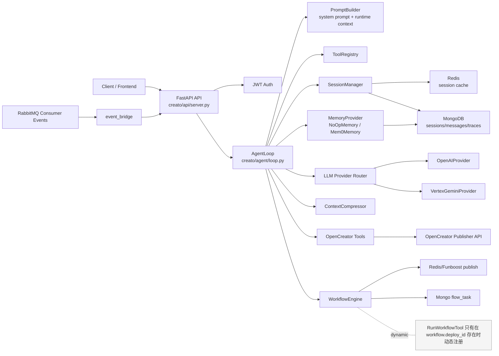

# 当前 Agent 项目架构梳理

## 1. 项目概览

这个仓库当前的主项目名是 `creato`，定位是一个面向 OpenCreator 画布工作流场景的 Agent 服务。它不是一个“纯本地 CLI Agent”，而是一个以 `FastAPI + SSE + AgentLoop` 为核心的服务端 Agent：

- 对外通过 `POST /v1/agent/chat` 提供对话入口。
- 对内通过 `AgentLoop` 组织 Prompt、LLM、Tools、Session、Memory。
- 在工作流场景下，还会接入 `WorkflowEngine + RabbitMQ + event_bridge`，把画布工作流执行事件实时回流给前端。

这个项目当前最重要的理解口径有两个：

- 当前真实生效的运行时主线：`build_app -> create_app -> AgentLoop -> Session/Memory/Tools/Provider`
- 代码里已经实现、但当前默认没有开放给主 Agent 的能力：如 `write_file`、`edit_file`、`list_dir`、`exec`、MCP 动态工具等

## 2. 根目录与主要子目录职责

### 2.1 根目录结构

| 目录/文件 | 作用 | 在主链路中的位置 |
| --- | --- | --- |
| `creato/` | 主代码目录，Agent 服务核心都在这里 | 主链路 |
| `docs/最佳实战/` | OpenCreator 工作流业务知识库与节点说明 | 给 skills 提供业务知识，不直接参与 runtime |
| `docs/项目梳理/` | 项目接手文档目录 | 文档层 |
| `tests/` | 行为测试、回归测试、历史残留线索 | 辅助理解现状与遗留 |
| `nanobot/` | 当前几乎为空，仅见空 skills 目录 | 不在现行主 runtime 中 |
| `pyproject.toml` | Python 包配置、依赖、入口脚本 | 启动与依赖声明 |
| `start.sh` / `start_bg.sh` | 启动脚本 | 部署辅助 |
| `funboost_config.py` | Funboost 读取的 Redis 配置 | Workflow 发布链路辅助 |

### 2.2 `creato/` 下各目录能力分析

| 目录 | 作用 | 典型文件 | 在主链路中的位置 |
| --- | --- | --- | --- |
| `creato/api` | FastAPI 服务入口，提供 chat/sessions/messages API | `server.py` | 请求入口 |
| `creato/agent` | Agent 主循环、Prompt、Tools、Skills、Memory、上下文裁剪 | `loop.py` `prompt/builder.py` `tools/` `skills/` | 核心编排层 |
| `creato/session` | 会话管理、历史读写、Redis/Mongo 持久化编排 | `manager.py` | 历史与状态层 |
| `creato/providers` | LLM 抽象层与具体模型供应商实现 | `base.py` `openai_provider.py` `vertex_gemini_provider.py` | 模型调用层 |
| `creato/workflow` | 工作流执行引擎、任务发布、事件桥接 | `engine.py` `task_publisher.py` `event_bridge.py` | 画布执行链路 |
| `creato/database` | Mongo、Redis、RabbitMQ 连接与集合绑定 | `mongo.py` `redis.py` `rabbitmq.py` | 基础设施适配层 |
| `creato/config` | 配置 schema、配置文件加载、环境变量覆盖 | `schema.py` `loader.py` | 全局配置入口 |
| `creato/security` | SSRF/内网地址/URL 安全校验 | `network.py` | Web 工具安全层 |
| `creato/bus` | Inbound/Outbound 消息结构定义 | `events.py` | 内部消息模型 |
| `creato/utils` | 时间、token 估算、消息构造等通用工具 | `helpers.py` | 通用支撑 |
| `creato/sentry.py` `creato/posthog.py` | 监控、埋点与链路追踪 | 独立文件 | 可观测性 |

### 2.3 `docs/最佳实战` 的定位

`docs/最佳实战` 不是运行时代码，但它很重要，因为它承载了 OpenCreator 工作流场景的业务知识：

- `nodes/`：节点级说明
- `工作流结构Best Practices/`：典型工作流结构模式
- `原子+模型+高级参数边界/`：模型能力与参数边界

这些内容主要通过 `creato/agent/skills/workflow-user-guide` 和 `edit-workflow` skill 间接被 Agent 使用。

### 2.4 `nanobot/` 当前状态

`nanobot/` 目录当前只有空的 `skills/` 目录和系统生成文件，没有看到被现行 runtime 引用的代码、配置或 skills 装载逻辑。因此当前接手时，可以把它视为“保留目录/未接入目录”，不纳入现行 Agent 主架构。

## 3. Agent 核心架构

### 3.1 启动主线

当前服务启动主线非常清晰：

1. `python -m creato`
2. 进入 `creato/__main__.py`
3. 调用 `creato.api.server.build_app()`
4. `build_app()` 负责加载配置与创建 provider
5. `create_app(config, provider)` 负责初始化数据库、SessionManager、Memory、AgentLoop、FastAPI 路由

也就是说，`build_app -> create_app -> AgentLoop` 是系统真正的启动主线。

### 3.2 系统架构图



### 3.3 架构分层理解

从接手角度，这个 Agent 可以拆成 6 层：

| 层 | 模块 | 作用 |
| --- | --- | --- |
| 接口层 | `creato/api` | 接 HTTP/SSE 请求，做鉴权和流式返回 |
| 编排层 | `creato/agent/loop.py` | 串起 session、memory、prompt、LLM、tool calls |
| 能力层 | `creato/agent/tools` `creato/agent/skills` | 提供可调用能力和业务知识 |
| 模型层 | `creato/providers` | 统一 LLM 调用接口 |
| 状态层 | `creato/session` `creato/agent/memory` | 管理短期历史、压缩上下文、长期记忆 |
| 基础设施层 | `creato/database` `creato/workflow` | 连接 Mongo/Redis/RabbitMQ，处理 workflow 执行 |

### 3.4 普通问答链路 vs 工作流链路

这两个链路需要分开理解：

- 普通文本问答主链路：`API -> AgentLoop -> Prompt/LLM/Tools -> Session/Memory -> SSE`
- 工作流执行主链路：`RunWorkflowTool -> WorkflowEngine -> Funboost/Redis -> 外部 Consumer -> RabbitMQ -> event_bridge -> SSE`

`RabbitMQ + event_bridge` 只服务于 workflow 执行事件回流，不是普通文本问答的必经路径。

## 4. 当前 Tools 梳理

### 4.1 当前运行时默认注册的 tools

当前 `AgentLoop._register_default_tools()` 默认注册的工具如下：

| Tool | 注册位置 | 能力 | 边界 | 当前是否生效 |
| --- | --- | --- | --- | --- |
| `read_file` | `creato/agent/loop.py` | 读取文件内容，支持分页 | 只读；可受 workspace 限制 | 是 |
| `web_search` | `creato/agent/loop.py` | 联网搜索 | 依赖配置的搜索 provider | 是 |
| `web_fetch` | `creato/agent/loop.py` | 抓取网页并提取正文 | 含 SSRF 安全校验，外部内容视为不可信 | 是 |
| `spawn` | `creato/agent/loop.py` | 启动后台 subagent | subagent 当前也只带有限工具集 | 是 |
| `get_workflow` | `creato/agent/loop.py` | 拉取当前画布工作流 | 依赖 `flow_id` + `auth_token` | 是 |
| `get_workflow_results` | `creato/agent/loop.py` | 拉取节点最近一次执行结果 | 依赖当前画布上下文 | 是 |
| `get_node_spec` | `creato/agent/loop.py` | 获取节点规格、模型表、连接规则 | 仅返回规格信息 | 是 |
| `edit_workflow` | `creato/agent/loop.py` | 全量替换当前工作流 nodes/edges | 必须先读 `get_workflow`，属于高影响操作 | 是 |
| `load_skill` | `creato/agent/loop.py` | 按名称加载完整 `SKILL.md` | 只加载 skill 内容，不直接执行 shell | 是 |
| `run_workflow` | `creato/api/server.py` 动态注册 | 运行工作流并返回事件流 | 只有配置了 workflow engine 才能注册 | 条件生效 |

### 4.2 每个当前生效 tool 的定位

#### `read_file`

- 面向本地文件系统。
- 当前主 Agent 只有只读，没有默认开放写入、编辑、列目录。
- 如果启用了 `restrict_to_workspace`，还会被限制在 workspace 下；读取内置 skills 时额外放行了 `BUILTIN_SKILLS_DIR`。

#### `web_search` / `web_fetch`

- 面向外部网络。
- `web_search` 负责搜索结果发现，支持 `brave`、`tavily`、`duckduckgo`、`searxng`、`jina`。
- `web_fetch` 负责正文抓取，优先走 Jina Reader，失败时回退到 `readability-lxml`。
- 所有抓取内容都显式打上“外部不可信内容”标记，避免 prompt injection。

#### `spawn`

- 面向后台子任务。
- 当前 subagent 也只开放了有限工具：`read_file`、`web_search`、`web_fetch`。
- 仓库里虽然实现了 subagent 可支持更多工具，但当前 rollout 同样关闭了写文件和 shell。

#### OpenCreator 相关 tools

这组工具面向 OpenCreator 画布业务：

| Tool | 面向对象 | 作用 |
| --- | --- | --- |
| `get_workflow` | 当前画布 | 获取完整工作流 |
| `get_workflow_results` | 当前画布 | 获取节点历史输出结果 |
| `get_node_spec` | 节点规格库 | 查询节点配置、模型、连接规则 |
| `edit_workflow` | 当前画布 | 保存编辑后的完整工作流 |
| `run_workflow` | 当前画布 + Consumer | 提交执行并订阅事件 |

它们大多依赖 `request_context` 中的私有上下文：

- `auth_token`
- `flow_id`
- `user_id`

这些上下文不会进入 system prompt，而是作为 tool 的私有执行上下文使用。

#### `load_skill`

- 面向内置 skills 目录。
- `PromptBuilder` 默认只把 skills summary 放进 system prompt。
- 真正要使用某个 skill 的详细规则时，需要调用 `load_skill(name=...)` 把完整 `SKILL.md` 读出来。

### 4.3 代码里已实现但当前默认未开放的 tools

这些能力代码已经实现，但当前主 Agent 默认没有注册：

| Tool | 代码位置 | 当前状态 | 原因/备注 |
| --- | --- | --- | --- |
| `write_file` | `creato/agent/tools/filesystem.py` | 未注册 | 当前 rollout 禁止 workspace 写操作 |
| `edit_file` | `creato/agent/tools/filesystem.py` | 未注册 | 当前 rollout 禁止 workspace 写操作 |
| `list_dir` | `creato/agent/tools/filesystem.py` | 未注册 | 当前 rollout 禁止暴露目录浏览 |
| `exec` | `creato/agent/tools/shell.py` | 未注册 | 当前 rollout 禁止 shell 执行 |
| MCP 动态工具 | `creato/agent/tools/mcp.py` | 未连接 | `_connect_mcp()` 当前直接 return |
| `message` | `creato/agent/tools/message.py` | 实现存在但未注册 | 当前 API 模式主要依靠 SSE 返回，不靠 tool 主动发消息 |

### 4.4 当前真实可用 vs 仓库实现的区别

这是接手时最容易看混的地方：

- “工具类存在”不等于“当前主 Agent 能调用”
- 真正要看的是 `AgentLoop._register_default_tools()`
- 另外还要看 `create_app()` 里有没有动态补注册，比如 `RunWorkflowTool`

## 5. 当前 Skills 梳理

### 5.1 内置 skills 来源与装载机制

当前 skills 全部来自：

- `creato/agent/skills/*/SKILL.md`

装载机制由 `SkillsLoader` 负责：

1. Agent 初始化时扫描 `creato/agent/skills/`
2. 解析 `SKILL.md` frontmatter
3. 缓存成 `SkillInfo`
4. 在 system prompt 中注入 skills summary
5. 需要详细 skill 内容时，再通过 `load_skill` 工具按需加载

### 5.2 当前仓库内真实存在的 skills

| Skill | 作用 | 触发方式/定位 | 当前环境可用性 |
| --- | --- | --- | --- |
| `edit-workflow` | 在当前画布里直接编辑 OpenCreator 工作流 | 面向“直接改画布并保存” | 可用 |
| `workflow-user-guide` | 以咨询模式讲解节点、链路、工作流设计 | 面向“如何搭、如何改、怎么选节点” | 可用 |
| `weather` | 查询天气 | 依赖 `curl` | 当前机器可用 |
| `summarize` | 总结网页、文件、YouTube 等内容 | 依赖 `summarize` CLI | 当前机器不可用，因缺少 `summarize` 命令 |

### 5.3 Skills 的几个关键实现点

- skills summary 会出现在 system prompt 中，但只是摘要，不是全文。
- `load_skill` 才是把完整 `SKILL.md` 内容送进模型上下文的入口。
- `always: true` 机制在 `SkillsLoader.get_always_skills()` 中存在，但当前仓库里的 skill 基本没有明显始终注入场景。
- skill 是否“available”由 frontmatter 中的 `requires_bins`、`requires_env` 决定。

### 5.4 关于 `nanobot/skills`

当前没有看到 `nanobot/skills` 被 `SkillsLoader` 或其他 runtime 逻辑引用，因此它不是当前 Agent 的 skills 来源。

## 6. Query 进入后的完整流转

### 6.1 时序图

```mermaid
sequenceDiagram
    participant U as User/Frontend
    participant API as FastAPI /v1/agent/chat
    participant LOOP as AgentLoop
    participant S as SessionManager
    participant M as MemoryProvider
    participant P as PromptBuilder
    participant LLM as Provider
    participant T as ToolRegistry
    participant SSE as SSE Stream

    U->>API: POST /v1/agent/chat
    API->>API: JWT 鉴权
    API->>API: 组装 private_context + metadata
    API->>LOOP: process_direct(...)
    LOOP->>S: get_or_create(session_id)
    S-->>LOOP: session history
    LOOP->>M: retrieve(user_id, query)
    M-->>LOOP: memory context
    LOOP->>P: build_messages(...)
    P-->>LOOP: messages
    LOOP->>LLM: chat_stream_with_retry(...)
    LLM-->>LOOP: 文本增量 / tool calls
    LOOP->>T: execute(tool, args)
    T-->>LOOP: tool result
    LOOP->>LOOP: _save_turn()
    LOOP->>S: save(session, tool_traces)
    LOOP->>M: store(...)（后台异步）
    LOOP-->>SSE: agent/tool/workflow/message 事件
    SSE-->>U: 流式返回
```

### 6.2 10 步固定流转

#### 1. `POST /v1/agent/chat` 收到请求

入口在 `creato/api/server.py` 的 `chat()`。

#### 2. JWT 鉴权，拿到 `user_id`

通过 `_authenticate_agent_request()` 解 Clerk JWT，拿到：

- `user_id`
- 原始 `token`

#### 3. 组装 `private_context` 与 `metadata`

`private_context` 当前会携带：

- `auth_token`
- `flow_id`
- `time_zone`
- `user_id`

`metadata` 会保留前端传入信息，并在有 `flow_id` 时合并进去。

#### 4. 调用 `AgentLoop.process_direct(...)`

`process_direct()` 会把请求转成 `InboundMessage`，然后走 `_locked_process()`，保证：

- 同一 session 串行
- 多 session 可并发

#### 5. `SessionManager.get_or_create()` 读取 Redis / Mongo 会话

读取顺序是：

1. Redis ctx cache
2. Mongo
3. 新建空 session

#### 6. `memory.retrieve()` 召回长期记忆

如果 `cfg.memory.enabled` 为真，则会初始化 `Mem0Memory`，每次请求先按 `user_id + query` 检索相关长期记忆。

#### 7. `PromptBuilder.build_messages()` 组装 messages

Prompt 组装规则很重要：

- system prompt 只放静态内容：identity + skills summary
- runtime metadata 不放 system prompt，而是放到当前 user message 前缀
- 被裁剪历史的摘要和长期记忆，会作为额外的 user message 注入到 history 前面

#### 8. `provider.chat_stream_with_retry()` 调 LLM

主循环通过 provider 的流式接口拉取：

- 文本增量
- tool calls
- usage
- thinking blocks

如果 provider 支持原生流式，就走原生流式；否则回退到单次 `chat()` 封装的流。

#### 9. 如有 tool call，经 `ToolRegistry.execute()` 执行并回灌

当 LLM 返回 tool calls 时：

1. 先把 assistant tool_call 消息加回 messages
2. 逐个执行 tool
3. tool result 以 `role=tool` 追加回 messages
4. 然后继续进入下一轮 LLM 迭代

如果是 `RunWorkflowTool`，返回的不是普通字符串，而是 `WorkflowExecution`，主循环会消费它的事件流并转成 `workflow.*` SSE 事件。

#### 10. `_save_turn()` 持久化消息与 traces，后台触发 summary 和 memory.store

主循环结束后会：

- `_save_turn()`：把本轮 user / agent / assistant / tool 消息写入 session
- `SessionManager.save()`：写 Mongo + Redis
- `_maybe_generate_summary()`：异步生成 session 标题
- `_store_memory_async()`：异步提取长期记忆
- SSE 持续把 `message.delta`、`tool.*`、`workflow.*`、`agent.completed` 送回前端

### 6.3 长对话上下文控制

当前上下文不是简单“截断最后 N 条”，而是更稳的三段式：

1. `Session.get_history()` 先做合法 tool-call 边界对齐
2. `AgentLoop._trim_history()` 按 token budget 做 sliding window
3. 被丢弃的历史通过 `ContextCompressor` 压成摘要再注入

### 6.4 前端显示与 LLM 上下文不是同一份数据

这是另一个常见误区：

- LLM 上下文会保留 `assistant` 中间 tool_call 消息和 `tool` 结果
- 前端分页接口 `GET /v1/agent/sessions/{session_id}/messages` 只返回 `user` 和 `agent`

也就是说，给模型看的上下文比给用户看的消息更完整。

## 7. 记忆模块实现

当前项目里的“记忆”其实分成 3 层，不是单一模块。

### 7.1 短期会话记忆：`SessionManager`

这是最核心的一层，负责同一 session 内的上下文连续性：

- Redis 存热缓存
- Mongo 存长期持久化
- 会保存 `user`、`agent`、中间 `assistant`、`tool` 等完整 LLM 上下文消息

作用：

- 下一轮对话构造 history
- 支撑前端会话列表与消息分页
- 保留 tool traces 供分析

### 7.2 上下文压缩记忆：`ContextCompressor`

当对话太长时，完整历史放不进 context window，系统不会直接粗暴丢弃，而是：

1. 识别被裁剪掉的历史消息
2. 调用轻量模型压缩成摘要
3. 把摘要作为动态上下文重新注入

它本质上是“上下文保真机制”，不是长期用户记忆库。

### 7.3 长期用户记忆：`Mem0Memory`

当前长期记忆实现是 `creato/agent/memory/mem0_memory.py`：

- 按 `user_id` 建立跨 session 记忆
- 底层依赖 `mem0`
- vector store 落在 MongoDB
- embedding 依赖 OpenAI embedding model
- memory 提取也依赖 OpenAI LLM

### 7.4 长期记忆的实际工作方式

| 阶段 | 行为 |
| --- | --- |
| 初始化 | 只有 `memory.enabled=true` 才会创建 `Mem0Memory` |
| 请求前 | `retrieve(user_id, query)` 先召回相关记忆 |
| Prompt 构造 | 以“你知道这个用户的事情”形式注入到动态 context |
| 请求后 | `_store_memory_async()` 后台异步执行 `store()` |
| 入库存储对象 | 只存 `user` / `agent` 文本消息，不存 `tool` 和中间 `assistant` |

### 7.5 当前记忆实现的一个重要注意点

`creato.agent.memory.__init__` 当前只导出：

- `MemoryProvider`
- `MemoryEntry`
- `NoOpMemory`

但测试里仍能看到 `MemoryStore`、`save_memory` 等旧设计痕迹。这说明：

- 测试目录保留了一部分历史记忆设计
- 当前运行时主线已经切到 `Mem0Memory` 这一套
- 新接手时不要把 `tests/test_memory_consolidation_types.py` 里的旧记忆设计误判为现行主线

## 8. 数据存储与基础设施

### 8.1 MongoDB

| 集合 | 作用 |
| --- | --- |
| `agent_sessions` | session 元数据 |
| `agent_messages` | 全量消息历史，包含 user/agent/assistant/tool |
| `agent_tool_traces` | tool 执行输入输出与耗时 |
| `flow_task` | workflow 执行任务记录 |

Mongo 负责：

- 长期持久化
- 索引
- tool traces 分析
- workflow task 状态存档

### 8.2 Redis

| Key | 作用 |
| --- | --- |
| `agent:session:meta:{session_id}` | session 元信息缓存 |
| `agent:session:ctx:{session_id}` | LLM 上下文完整缓存 |

Redis 负责：

- 热缓存
- 降低每轮从 Mongo 全量回放历史的成本
- workflow kill flag 等轻量状态

### 8.3 RabbitMQ

RabbitMQ 当前只服务工作流结果回传：

`Consumer -> RabbitMQ -> creato.database.rabbitmq -> event_bridge -> SSE`

它不是普通问答主链路的一部分。

### 8.4 Provider

当前 provider 层是统一抽象 + 多实现：

| Provider | 说明 |
| --- | --- |
| `OpenAIProvider` | OpenAI-compatible 接口，当前默认主力 provider |
| `VertexGeminiProvider` | Vertex AI Gemini，支持 Gemini 系列模型 |

Provider Router 通过模型前缀做分发，例如：

- `openai/gpt-4.1`
- `vertex_gemini/gemini-3-pro`

## 9. 当前生效能力 vs 已实现未启用能力

### 9.1 当前真实生效

当前主 Agent 真正在线上会走到的核心能力：

- FastAPI + SSE 对话服务
- SessionManager 的 Redis/Mongo 会话管理
- PromptBuilder 的静态 prompt + 动态 context 注入
- OpenAI / Vertex Gemini provider
- `read_file`、`web_search`、`web_fetch`、`spawn`
- OpenCreator 工作流相关 tools
- `load_skill`
- 可选的 `Mem0Memory`
- 可选的 `RunWorkflowTool` 动态注册

### 9.2 已实现但默认未启用

当前仓库里已有实现、但默认关闭或未接入的能力：

- 本地写文件
- 本地编辑文件
- 列目录
- shell 执行
- MCP 动态工具接入
- MessageTool 主动发消息模式

### 9.3 历史残留/理解陷阱

接手时最值得特别注意的几个“坑”：

| 现象 | 解释 |
| --- | --- |
| 测试里出现 `MemoryStore` | 旧记忆设计残留，不是当前主 runtime 的主线 |
| 测试里出现 `Session(key=...)` | 说明测试与现行 `Session(session_id=...)` 代码存在演进痕迹 |
| `creato/agent/tools/*.py` 里很多工具类都在 | 不代表当前 Agent 都开放 |
| `nanobot/skills` 存在 | 当前未见被 runtime 引用 |

## 10. 结论与接手建议

### 10.1 一句话总结

这个项目当前可以理解为一个“面向 OpenCreator 画布场景的服务端 Agent 编排系统”，其核心不是多 Agent 协作框架，而是：

`FastAPI API + AgentLoop + ToolRegistry + SessionManager + Provider + WorkflowEngine`

### 10.2 你接手时最该先抓住的主线

建议按这个顺序理解代码：

1. `creato/api/server.py`
2. `creato/agent/loop.py`
3. `creato/agent/prompt/*`
4. `creato/session/manager.py`
5. `creato/agent/tools/*`
6. `creato/providers/*`
7. `creato/agent/memory/*`
8. `creato/workflow/*`

### 10.3 当前项目的核心数据流

接手时可以把整条主线记成一句话：

“请求进来后，先鉴权并取 session/history，再召回 memory，拼 prompt 调 LLM；如果有 tool call 就执行工具并回灌，最后把消息、trace、summary、memory 分别落到 Redis/Mongo/后台任务，并持续通过 SSE 回给前端。”

### 10.4 后续阅读建议

如果你下一步要继续深入，建议优先看这三块：

- `edit_workflow + get_node_spec + common.py`：这是 OpenCreator 业务最重的地方
- `SessionManager + _save_turn()`：这是理解上下文与历史持久化的关键
- `Mem0Memory + ContextCompressor`：这是理解“记忆”和“上下文裁剪”差异的关键

